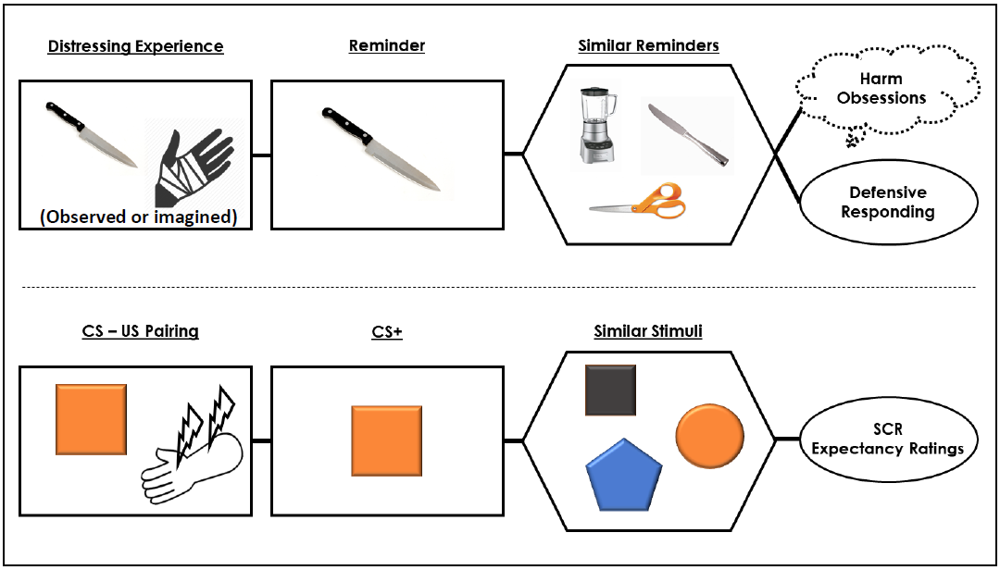
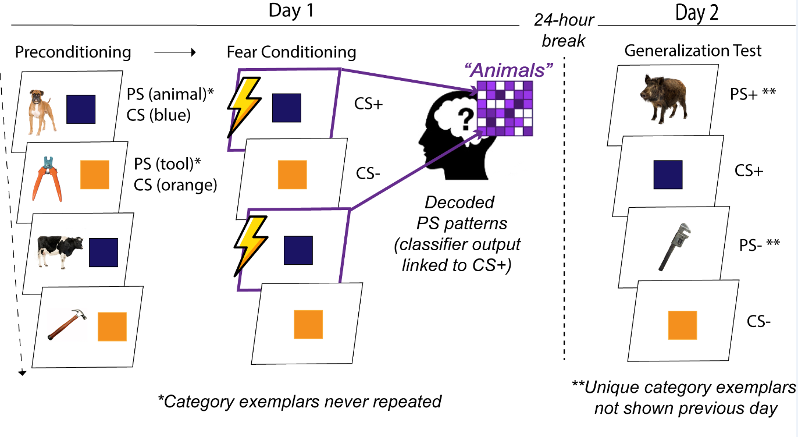

Part of the fun of my day-to-day work is the variety of interesting and useful methodological techniques I get to use. Below are the methods I most commonly use and with which I have some degree of competency.

# Experimental Psychopathology

Most of my work involves the building and implementation of experimental tasks that probe psychopathologically-relevant processes. In particular, I make use of **classical and instrumental conditioning paradigms** to study the emotions and behaviors. Given my interests, most of the time I am using these techniques to study **fear and avoidance**. In these tasks, I pair an inherently aversive stimulus (e.g., mild electric stimulation) with a neutral stimulus (e.g., a generic picture or sound) until the neutral stimulus is no longer neutral - it now provokes a negative emotional or behavioral response without any help from the original aversive stimulus. These responses, formally known as **conditioned responses**, are what I measure and what are thought to underlie the distress and impairment seen in many forms of anxiety.

*Example of classical conditioning model applied to OCD; adapted from [Cooper & Dunsmoor, 2021, Neurosci Biobehav Rev](https://www.sciencedirect.com/science/article/abs/pii/S0149763421003262)*

There are many ways to measure conditioned responses. I primarily use **self-report** and **physiological** (e.g., **startle blink, sweat response, heart rate**) measures. In the past I have also used **eye-tracking** and **pupilometry** to assess attentional and arousal conditioned responses, and I hope to return to these methods in the future. I also currently oversee a study using **virtual reality (VR)** technology to modulate retention of fear learning. Finally, a major goal of my postdoc is to gain substantial experience in **functional magnetic resonance imaging (fMRI)**, a neuroimaging technique that allows us to assess conditioned responding at the level of the brain and its constituent circuits. An F32 from NIMH currently funds my training in this area, including the implementation of an fMRI study of category preconditioning . This involves the use of a novel task developed in the Dunsmoor lab:

*Schematic of a fMRI optimized "category preconditioning" paradigm that uses MVPA decoding techniques to derive indices of neural similarity.*

# Quantitative Psychopathology

Although experimental techniques are at the core of my work, it's in combination with individual differences sciences that allows it to provide answers to scientific questions regarding the nature, development, and treatment of psychopathology. In particular, I use **dimensional** models of psychopathology - which treat mental illness as just the extreme or less common part of a continuum of human behavior and internal processes, as opposed to qualitatively distinct categories - to understand how pathological processes differ across and within people. Part of this work involves understanding how psychopathology is organized and structured in the first place. Recent work has involved using dimension **reduction techniques** (e.g., exploratory factor analysis, mixture modeling) to more precisely capture the underlying psychological dimensions that span a variety of symptoms or conditions, specifically those commonly defined as anxiety-related disorders. This work is inspired by and aligns with the [Hierarchical Taxonomy of Psychopathology (HiTOP)](https://renaissance.stonybrookmedicine.edu/HITOP), an effort to improve our models of psychopathology.

*Graphical reimagining of table showing predictive relations between latent maladaptive personality factors and different types of OCD symptoms (Checking, Hoarding, Neutralizing, Obsessing, Ordering, Washing) across two samples; adapted from [Cooper et al., 2022, Assessment](https://journals.sagepub.com/doi/full/10.1177/10731911211070623)*

Linking psychopathological individual differences to purportedly psychopathological processes, as measured by experimental tasks, can require a complex statistical framework to facilitate meaningful and robust inferences. **Mixed effects regression** (sometimes referred to as multilevel modeling) are a major part of my work and I continue to train in advanced applications of these models, including mediation frameworks and non-linear modeling. I also have training in using **structural equation modeling (SEM)** techniques, which provides a framework for understanding complex relations between both observed/measured variables and *latent* or unmeasured variables. Using these types of techniques allows us to test hypotheses that fully appreciate the complex systems typically involved in the psychological and biological processes that contribute to psychopathology.
